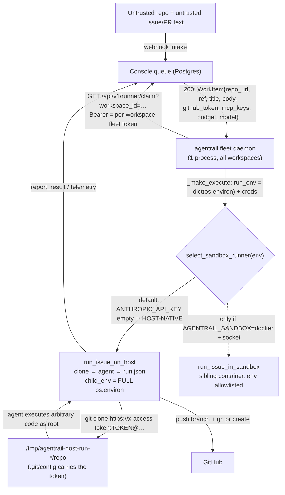

# Factory multi-tenant isolation — threat model

> **Status:** PR① of #1295 (Wave 5, epic #1257) — **AC1: "Threat model reviewed and committed."**
> This document is the *current-state, honest* picture. It changes **no code**. The
> hardening it recommends is PR②, gated on the owner reviewing this doc first (AC2).
>
> **Scope:** the *factory* — the hosted **fleet** that executes dispatched issues for
> many customer workspaces from one process (`agentrail fleet`, `deploy/fleet/railway.json`).
> The single-tenant dogfood runner (`deploy/docker-compose.prod.yml`) is in scope only
> where it shares the same execution seam, and is called out separately when its posture
> differs (usually: worse).
>
> **Grounding rule:** every "the system does X" claim below cites a file:line that was
> read. Anything not determinable from code is marked **OPEN QUESTION**, not guessed.

---

## 0. The core threat

A customer's **repo contents and issue/PR text are UNTRUSTED input.** When the fleet
claims an issue it:

1. clones that customer's repo (arbitrary code) into a working directory, and
2. runs a coding agent (`claude --bare -p --dangerously-skip-permissions`,
   `deploy/runner/Dockerfile:201`) over the issue title/body (arbitrary text) **with
   permissions skipped** — i.e. the agent will execute arbitrary shell without a human
   gate.

So the realistic attacker is: *a malicious repo, or a malicious issue/PR body, crafted to
make the agent run attacker-controlled code inside the fleet.* The question this model
answers is **what that code can reach today.**

The short answer, established below: on the **default (host-native) execution path** the
agent's child process inherits the **entire fleet-process environment** with **no
allowlist** (`agentrail/sandbox/native_runner.py:481-482`), runs **as root**
(`deploy/runner/Dockerfile:203`) in the **one shared fleet container** that also holds
**every other tenant's runner token** (`agentrail/runner/fleet_credentials.py:40-142`),
with **unrestricted network egress**. The per-task-container work (#1267) exists but is
**off by default and not the deployed shape** (`deploy/fleet/README.md:138-154`).

---

## 1. System & data-flow

### Components and who runs them

| Component | Where it runs | Who controls it | Trusted? |
|---|---|---|---|
| Customer repo (code, hooks, `CLAUDE.md`, build scripts) | cloned into the fleet | **the customer / attacker** | **NO** |
| Issue / PR title + body | claim payload → agent prompt | **the customer / attacker** | **NO** |
| Coding agent (`claude --bare`) | fleet host (native) or sibling container (docker mode) | AgentRail image, but *driven by* untrusted input | **NO once running** |
| `agentrail fleet` daemon (claim→execute→report loop) | one Railway container, 1 replica | AgentRail (operator) | yes |
| Console API (`/api/v1/runner/*`, `/api/v1/fleet/*`) | separate console service | AgentRail (operator) | yes |
| Postgres (all tenants' rows, connector secrets, sessions) | separate service | AgentRail (operator) | yes |
| Fleet control plane (`FLEET_CONSOLE_TOKEN` → mint per-workspace tokens) | console sync route | AgentRail (operator) | yes |

### Flow (one claimed issue)

Key structural facts, cited:

- **One process serves all workspaces.** `agentrail/runner/fleet_worker.py:1-25` — the
  fleet round-robins over every known workspace inside a single process/container; slots
  are threads, not containers (`fleet_worker.py:363-381`).
- **The execute callback is shared byte-for-byte with the single-tenant runner.**
  `agentrail/cli/commands/fleet.py:66,94-109` reuses
  `agentrail.cli.commands.runner._make_execute` unchanged, so the env-forwarding behaviour
  below is identical on both deploy shapes.
- **Default backend is host-native, not a container.** `select_sandbox_runner`
  (`agentrail/sandbox/native_runner.py:904-968`) returns `run_issue_on_host` unless
  `AGENTRAIL_SANDBOX=docker` is set *or* `ANTHROPIC_API_KEY` is non-empty. The fleet image
  bakes `ANTHROPIC_API_KEY=""` on purpose (`deploy/runner/Dockerfile:196`), so the legacy
  trigger can never fire and **host-native is the deployed default**
  (`deploy/fleet/README.md:138-140`).

---

## 2. Trust boundaries

| # | Boundary | Enforced today? | Code that enforces / fails to enforce it |
|---|---|---|---|
| B1 | untrusted code ↔ **process environment** (secrets) | **NOT on the default path** | Host-native forwards the **whole** `os.environ` to the agent: `native_runner.py:481-482` (`child_env = dict(os.environ); child_env.update(env)`). The env allowlist `_DOCKER_SANDBOX_ENV_ALLOWLIST` (`native_runner.py:844-859`) is applied **only** by `_wrap_docker_sandbox_env` on the **docker** path (`native_runner.py:878-897, 944, 967`). The default path has no equivalent. |
| B2 | tenant ↔ tenant (fs / process / kernel) | **NOT enforced** | All concurrent runs share the one fleet container's filesystem, PID namespace, and kernel; the only separation is a per-run `tempfile.mkdtemp` dir (`native_runner.py:496`) that is `rmtree`'d after. `deploy/fleet/README.md:145-154` states this plainly: *"disposable-directory hygiene, not a security boundary."* |
| B3 | untrusted code ↔ **fleet control plane** (all tenants' tokens) | **NOT enforced** | The agent runs **as root** (`deploy/runner/Dockerfile:203`) in the same container that stores **every** workspace's fleet bearer token at `~/.agentrail/fleet-credentials.json` (`fleet_credentials.py:40-66,120-142`) and holds `FLEET_CONSOLE_TOKEN` in-env (`deploy/fleet/README.md` env table, `fleet_sync.py:74-108`). Nothing stops the agent reading either. |
| B4 | run ↔ **internal services** (network egress) | **NOT enforced** | No egress policy anywhere. Host-native shares the fleet host's network. The docker-path `docker run` argv (`docker_runner.py:230-241`) sets **no `--network`** flag → default bridge → full outbound internet. On the single-tenant compose shape the runner shares the default compose network with `postgres`/`console`/`jace` (`docker-compose.prod.yml:166-199`, no `networks:` scoping). |
| B5 | untrusted code ↔ **host kernel** (sandbox) | **partial, opt-in** | Only the agent CLI's own sandbox applies by default — and the agent is launched `--dangerously-skip-permissions` (`deploy/runner/Dockerfile:201`). The whole-process wrapper (`@anthropic-ai/sandbox-runtime`) is **OFF unless `AGENTRAIL_SANDBOX_RUNTIME=1`** (`native_runner.py:25-28,467`). No `--user`, `--read-only`, `--cap-drop`, or `--security-opt seccomp` on the docker path (`docker_runner.py:230-241`). |
| B6 | one workspace's git credential ↔ another run | **NOT enforced** | The workspace GitHub token is embedded into the clone URL (`clone_auth.py:16-32`, called at `native_runner.py:506`) and therefore persists in the clone's `.git/config` origin remote; there is **no post-clone scrub** (grep for `set-url`/`git config` in `native_runner.py` → none). A concurrent run on the shared filesystem (B2) can read another run's clone. |

---

## 3. Assets & attacker reachability (today)

For each asset: **can a malicious repo/issue reach it, and by what path?**

| Asset | Reachable today? | Path (grounded) |
|---|---|---|
| **`FLEET_CONSOLE_TOKEN`** — mints per-workspace runner tokens for *every* hosted workspace | **YES (default path)** | It is in the fleet process env; host-native forwards the whole env to the agent (`native_runner.py:481-482`). Read `env` → POST `/api/v1/fleet/workspace-tokens/sync` (`fleet_sync.py:84-108`) → receive minted tokens for all workspaces → claim/act as any tenant. **This is the top cross-tenant escalation.** |
| **Every tenant's fleet bearer token** (`fleet-credentials.json`) | **YES (default path)** | Agent runs as root (`Dockerfile:203`) in the container holding the store (`fleet_credentials.py:40-66`); `cat ~/.agentrail/fleet-credentials.json`. Each token authenticates that workspace's `claim`/`report` (`client.py:249-285`). |
| **Operator OpenRouter credential** (`ANTHROPIC_AUTH_TOKEN`, from `OPENROUTER_API_KEY`) | **YES (both paths)** | In-env on native (`native_runner.py:481-482`); **and explicitly allowlisted into the docker container** by design (`native_runner.py:760-771,846-847`). Attacker can bill unbounded model spend to the operator. |
| **This workspace's GitHub OAuth token** | **YES** | Embedded in the clone URL / `.git/config` (`clone_auth.py:16-32`, `native_runner.py:506`), and exported as `GH_TOKEN` in the agent's env (`native_runner.py:485-489`). Gives push + `gh` API access to that customer's repos. |
| **Another workspace's GitHub token** | **YES (concurrent runs)** | Via B2+B6: read a concurrently-running sibling's clone `.git/config` on the shared filesystem. |
| **Shared fallback GitHub PAT** (`GITHUB_TOKEN`, if operator set it) | **YES (default path)** | In-env (`native_runner.py:481-482`); its documented blast radius is "usable as a fallback across every workspace lacking its own connection" (`deploy/fleet/README.md` env table). |
| **Other tenants' rows / connector secrets in Postgres** | **fleet daemon: indirect; compose runner: DIRECT** | The **fleet** daemon holds no `DATABASE_URL` (not in `deploy/fleet/README.md` env table nor `railway.json`) — it reaches tenant data only through the console API, but with the tokens above it can drive those APIs as any tenant. The **single-tenant compose runner** is worse: `env_file: ./.env` (`docker-compose.prod.yml:171`) loads `DATABASE_URL`, `AUTH_SECRET`, `CONNECTOR_SECRET_KEY`, `GITHUB_WEBHOOK_SECRET`, `POSTGRES_PASSWORD` (`deploy/.env.production.example`) into the agent's env → **direct DB access + ability to decrypt every connector secret** on a network that can reach `postgres:5432`. |
| **The host / kernel** | **YES** | Arbitrary root code execution in the container (B3+B5); container escape reduces to "is this a real VM or a shared Docker host?" — see OPEN QUESTION below. |
| **Compute / $ (DoS, cryptomining, spend)** | **YES** | No CPU/mem/pids/disk cap on the host-native path (`deploy/fleet/README.md:147` — "no resource cap"); docker path caps only cpu/mem/pids (`docker_runner.py:233-236`), not disk or egress bandwidth. A per-run 3600s timeout exists (`native_runner.py:59`). |

**OPEN QUESTION (host boundary):** whether Railway's managed platform gives this service a
real VM boundary or a shared host is not determinable from this repo —
`deploy/fleet/README.md:186-190` explicitly says *"do not assume"* the platform exposes a
Docker socket and to treat "VM shape" literally. Container-escape reachability therefore
cannot be asserted either way here.

---

## 4. Current controls (honest inventory)

What actually exists today:

- **Per-run disposable working directory.** `tempfile.mkdtemp` + unconditional `rmtree`
  even on error/timeout (`native_runner.py:496-497`, teardown in the `finally`). This
  prevents *sequential* cross-run residue on disk within a workspace — **not** concurrent
  cross-tenant reads (B2).
- **Per-task container (exists, not the default).** `docker_runner.run_issue_in_sandbox`
  gives a fresh, always-removed container per task (`docker_runner.py:333-431`) with
  `--cpus`, `--memory`, `--pids-limit 512` (`docker_runner.py:233-236`). Reachable only via
  `AGENTRAIL_SANDBOX=docker` + a mounted Docker socket + the pre-built sandbox image; the
  Railway fleet shape does not enable it (`deploy/fleet/README.md:156-190`).
- **Docker-path env allowlist.** `_DOCKER_SANDBOX_ENV_ALLOWLIST` (`native_runner.py:844-859`)
  strips the process env down to a justified set before it enters the sibling container —
  **but only on the docker path**, and it **deliberately keeps** the OpenRouter credential
  inside (`native_runner.py:760-771`). It does nothing for the default host-native path.
- **Secrets forwarded by name, not on argv.** `docker run -e KEY` (`docker_runner.py:238-240`)
  and multiline handoffs kept off the command line (`docker_runner.py:56-60`) prevent
  *process-list* leakage — orthogonal to whether the *agent* can read the env (it can).
- **Token redaction in reported output.** `redact_token` scrubs the git token from
  `logs_tail`/`gate_reason`/exception strings before they leave the host
  (`clone_auth.py:35-53`, applied at `native_runner.py:518-524`; onboard mirrors it,
  `onboard.py:131-143`). This protects the *telemetry channel*, not the *agent's own view*
  of the credential in `.git/config`/env.
- **Per-workspace claim scoping + atomic claim.** Each claim is authenticated by that
  workspace's own bearer and scoped `?workspace_id=` (`client.py:266`), and the backend
  claim is `FOR UPDATE SKIP LOCKED` (`fleet_worker.py:68-71`) so two slots never take the
  same item. This is queue correctness, not code isolation.
- **Kill switches.** Revoke one workspace's `kind:'fleet'` api_keys row (instant on next
  claim), unset `FLEET_CONSOLE_TOKEN` (freezes provisioning), or scale to 0
  (`deploy/fleet/README.md` "Kill switches"). Incident response, not prevention.
- **Per-run timeout.** 3600s hard ceiling (`native_runner.py:59`, `docker_runner.py:48`).

### #1174 / sparse-checkout status (verified)

Prior finding #1174 ("the clone carried the corpus; git index resurrects keys; durable fix
= sparse-checkout"). **Current state:** the sparse-checkout fix exists **only in the eval
harness** — `agentrail/evals/runner.py:1102-1189`
(`_apply_answer_key_sparse_checkout`), which scopes the *corpus* clone's worktree to
exclude `answer_key/`. It is **not applied** to the production issue-run clone
(`native_runner.py:_clone_command:214-221` is a plain `git clone --depth 50`, no
`sparse-checkout`, no `--filter`) nor the onboard clone (`onboard.py:131-140`, plain
`--depth 1`). Worse for production than the eval case: the production clone **embeds the
workspace's GitHub token into `.git/config`** and never scrubs it (§2 B6), so the
"clone-carries-a-secret" class of issue #1174 is **still open on the production path**,
just with a live credential instead of corpus answer keys.

---

## 5. Gaps & prioritized hardening recommendations (input to PR②)

Ranked by **severity × exploitability**. Each gap gives a concrete **probe that must fail
closed** once PR② lands (these seed AC2's probe suite, §6).

### G1 — No env allowlist on the default (host-native) path → full secret exfiltration + cross-tenant takeover  ·  **CRITICAL**
The agent inherits the entire fleet env, including `FLEET_CONSOLE_TOKEN` and the OpenRouter
credential (`native_runner.py:481-482`; §3). Exploitability: trivial (`printenv`).
- **Fix:** apply an allowlist to the host-native child env too — reuse/extend
  `filter_docker_sandbox_env` (`native_runner.py:866-875`) so **both** backends strip the
  env down to a justified set. `FLEET_CONSOLE_TOKEN`, `POSTGRES_PASSWORD`, `AUTH_SECRET`,
  `CONNECTOR_SECRET_KEY`, and any other workspace's token must never be in the set.
- **Probe (must fail closed):** a task that runs `env` / reads `/proc/self/environ` must
  see **no** `FLEET_CONSOLE_TOKEN`, no `DATABASE_URL`, no `AUTH_SECRET`.

### G2 — Shared fleet container holds every tenant's token; agent runs as root  ·  **CRITICAL**
`fleet-credentials.json` (all workspaces) + the running container are readable by a root
agent (§2 B3, `fleet_credentials.py:40-66`, `Dockerfile:203`).
- **Fix:** move execution to a **per-task boundary** that cannot see the fleet token store
  (dedicated container/VM per claim with only that workspace's own short-lived token
  injected), run **non-root**, and keep the credential store outside the execution mount.
- **Probe:** a task must not be able to read `~/.agentrail/fleet-credentials.json` or any
  other workspace's token; `id -u` inside the run must not be 0.

### G3 — Unrestricted network egress → exfiltration + internal-service reach  ·  **CRITICAL**
No egress policy on either path (§2 B4). Docker path has no `--network`
(`docker_runner.py:230-241`); compose runner sits on the Postgres network
(`docker-compose.prod.yml:166-199`).
- **Fix:** deny-by-default egress with a narrow allowlist (the model endpoint, GitHub,
  the console API host) — e.g. `--network none` + an egress proxy, or a firewalled netns.
  The execution network must **not** route to `postgres:5432` or sibling internal services.
- **Probe:** a task that `curl`s the internal Postgres host, the console's internal
  address, or an arbitrary attacker host must be **refused/blocked**; only the allowlisted
  endpoints connect.

### G4 — Per-task credential is the wrong scope/lifetime  ·  **HIGH**
The OpenRouter credential is deployment-wide and long-lived and is *intentionally* placed
inside the run (`native_runner.py:760-771`); the GitHub token is a broad OAuth/PAT with no
per-run narrowing (`client.py:110-116`, `deploy/fleet/README.md` env table).
- **Fix:** inject only **short-lived, least-privilege, per-task** credentials — a scoped,
  expiring model token and a repo-scoped, time-boxed git token minted per claim; never the
  deployment-wide secret.
- **Probe:** the model/git credential visible to a task must be rejected when replayed
  after the run's TTL, and must not authenticate against a *different* workspace's repo.

### G5 — Clone `.git/config` carries a live credential; no sparse-checkout on prod path  ·  **HIGH**
§4 (#1174 status) + §2 B6. The token persists in the clone the untrusted agent runs inside.
- **Fix:** after clone, rewrite `origin` to a token-free URL (or use a credential helper /
  `http.extraHeader` that never lands in `.git/config`); scrub before the agent runs.
- **Probe:** `git config --get remote.origin.url` and `cat .git/config` inside the run must
  contain **no** `x-access-token:` / credential.

### G6 — Cross-task residue on shared filesystem between concurrent tenants  ·  **HIGH**
`mkdtemp` under a shared `/tmp` (`native_runner.py:496`); concurrent runs coexist (§2 B2).
- **Fix:** per-task filesystem namespace (subsumed by G2's per-task boundary); at minimum a
  private, unreadable-by-others tmp root per run.
- **Probe:** run A must not be able to list or read run B's working directory while both run.

### G7 — Sandbox not hardened; agent launched with permissions skipped  ·  **MEDIUM–HIGH**
`--dangerously-skip-permissions` (`Dockerfile:201`); process-sandbox wrapper OFF by default
(`native_runner.py:25-28,467`); docker path has no `--user`/`--read-only`/`--cap-drop`/
seccomp (`docker_runner.py:230-241`).
- **Fix:** non-root, read-only rootfs, dropped capabilities, a seccomp profile, and enable
  `AGENTRAIL_SANDBOX_RUNTIME` (or an equivalent) by default for hosted runs.
- **Probe:** a task attempting to write outside its workdir, load a kernel module, or use a
  disallowed syscall must be denied.

### G8 — No disk / bandwidth cap; host-native has no resource cap at all  ·  **MEDIUM**
`deploy/fleet/README.md:147` ("no resource cap"); docker path caps cpu/mem/pids only
(`docker_runner.py:233-236`).
- **Fix:** cpu + mem + pids + **disk quota** + egress-bandwidth cap + wall-clock (the 3600s
  timeout already exists) on **every** path.
- **Probe:** a task that tries to fill the disk or spawn unbounded work is capped/killed,
  and does not degrade concurrent tenants.

---

## 6. Documented probes (the adversarial suite PR② must make fail-closed)

PR② should ship these as tests/probes that a task run **cannot** pass. Listed with the gap
each defends:

1. **Env secret exposure (G1):** a task that reads its own environment
   (`env`, `/proc/self/environ`) sees no `FLEET_CONSOLE_TOKEN`, `DATABASE_URL`, `AUTH_SECRET`,
   `CONNECTOR_SECRET_KEY`, or `POSTGRES_PASSWORD`. → must be **absent**.
2. **Cross-tenant token store (G2):** a task cannot read
   `~/.agentrail/fleet-credentials.json` or any file containing another workspace's token. → **refused**.
3. **Internal Postgres reach (G3):** a task that opens a TCP connection to the Postgres host
   (`postgres:5432` / the `DATABASE_URL` host) is **blocked**.
4. **Console internal reach (G3):** a task that hits the console's internal address on any
   route other than the allowlisted public API is **blocked**.
5. **Arbitrary exfil host (G3):** a task that `curl`s an attacker-controlled external host is
   **blocked** (only allowlisted endpoints connect).
6. **Non-root execution (G2/G7):** `id -u` inside the run is **not 0**.
7. **Credential-scoped model token (G4):** the model credential visible to a task, replayed
   after the run ends, is **rejected** (short-lived, per-task).
8. **Git credential not in clone (G5):** `git config --get remote.origin.url` and `.git/config`
   inside the run contain **no** `x-access-token:` credential.
9. **Cross-run filesystem read (G6):** concurrent run A cannot read run B's working directory.
10. **Cross-workspace data read (B2/G2):** a task cannot read another workspace's row/clone/
    output — the canonical "a task cannot see another tenant's data" invariant.
11. **Resource cap (G8):** a task that tries to exhaust disk/CPU/pids is capped or killed
    without affecting other concurrent tenants.

---

## Appendix — key file map

| Concern | File:line |
|---|---|
| Fleet claim→execute→report loop (one process, all workspaces) | `agentrail/runner/fleet_worker.py:1-25,232-381` |
| Shared execute callback / env forwarding | `agentrail/cli/commands/runner.py:30-140`; `agentrail/cli/commands/fleet.py:66,94-109` |
| Host-native run (default), full-env child process | `agentrail/sandbox/native_runner.py:381-497` (esp. `481-482`) |
| Backend selection (host vs docker) | `agentrail/sandbox/native_runner.py:904-968` |
| Docker-path env allowlist (docker only) | `agentrail/sandbox/native_runner.py:844-897` |
| Per-task container flags (cpu/mem/pids, no net/user/ro/seccomp) | `agentrail/sandbox/docker_runner.py:213-241,333-431` |
| Clone URL credential embedding (→ `.git/config`) | `agentrail/sandbox/clone_auth.py:16-53`; used `native_runner.py:506` |
| Fleet per-workspace token store (all tenants, one container) | `agentrail/runner/fleet_credentials.py:40-142` |
| Per-workspace token minting (`FLEET_CONSOLE_TOKEN`) | `agentrail/runner/fleet_sync.py:74-108` |
| Sparse-checkout (eval-only; not on prod path) | `agentrail/evals/runner.py:1102-1189` |
| Runner image: root, baked env, skip-permissions agent | `deploy/runner/Dockerfile:195-218` |
| OpenRouter secret → `ANTHROPIC_AUTH_TOKEN` at start | `deploy/runner/entrypoint.sh:44-65` |
| Single-tenant runner: whole `.env` incl `DATABASE_URL`, shared net | `deploy/docker-compose.prod.yml:166-199`; `deploy/.env.production.example` |
| Fleet isolation posture (operator-facing, honest) | `deploy/fleet/README.md:132-198` |
